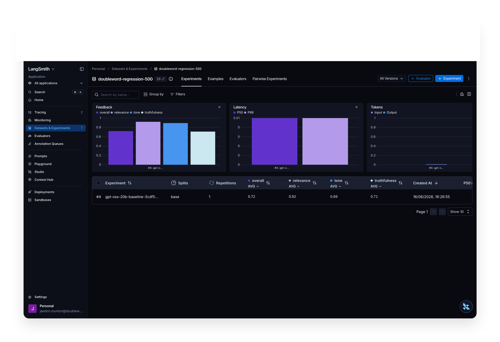
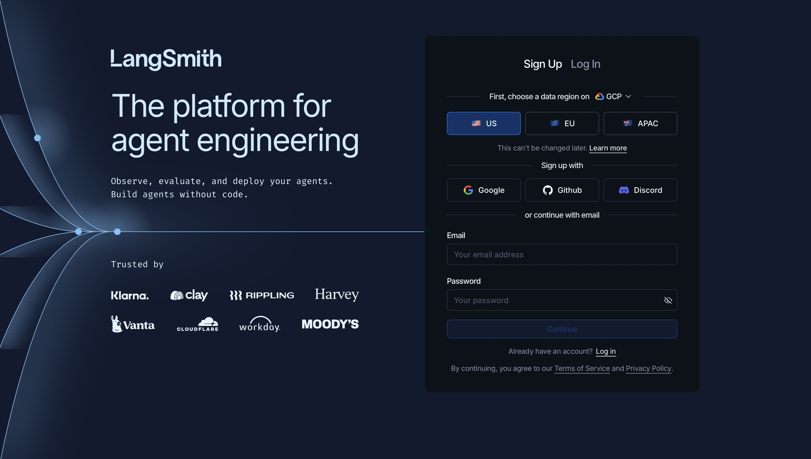
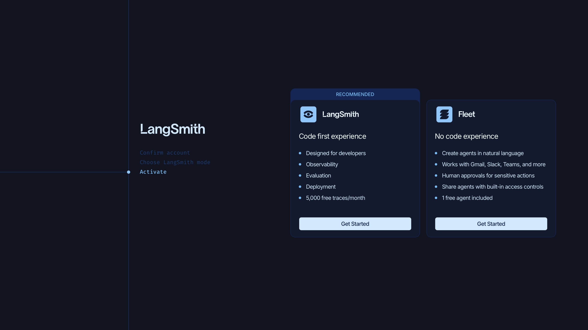
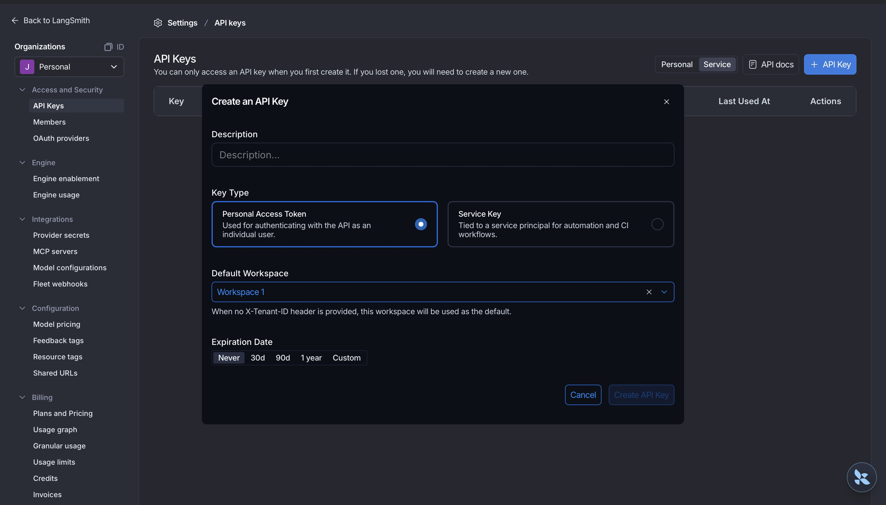
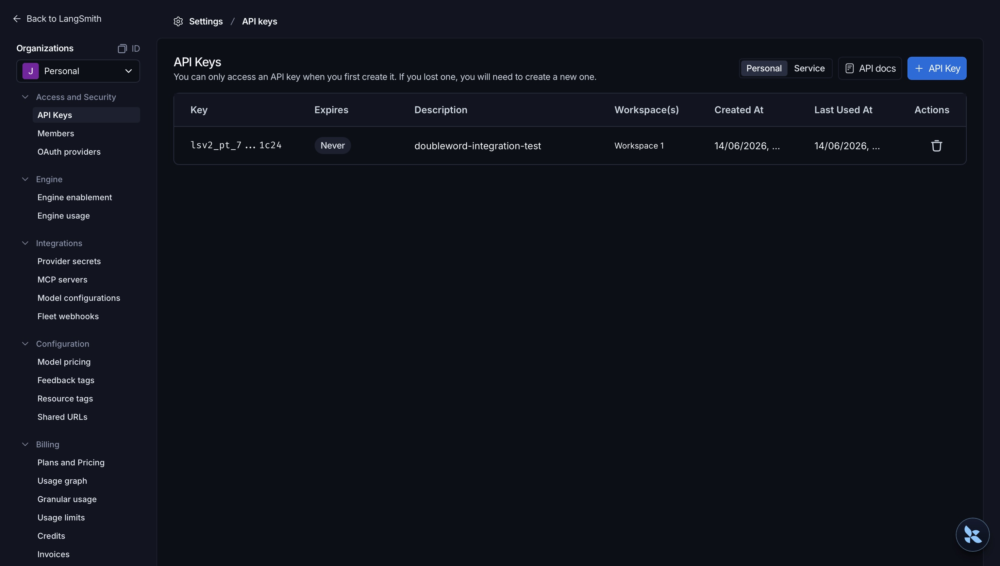

# LangSmith

[LangSmith](https://smith.langchain.com) is LangChain's cloud platform for tracing and evaluating LLM
apps. The eval most worth running continuously is an LLM-as-judge that catches prompt and model
regressions before they ship — and on Doubleword's batch tier it runs **7–27× cheaper** than the same
workload on a frontier model. The `langchain-doubleword` chat models are standard LangChain models, so
Doubleword slots straight into LangSmith tracing and evals.

## What it costs

We tested a 500-example LLM-as-judge regression eval in which one app answers a set of questions, a stronger model
grades each answer. The cost was **$0.44** on Doubleword (gpt-oss-20b answering, DeepSeek-V4-Pro judging),
measured with `dw batches analytics`. In production the answers already exist, so the eval you re-run
on every change is the judge: about **$0.00076 per trace** with this model as an evaluator. 

Cost scales linearly. Per million evals, against the same token volume on a frontier model (GPT-5.5 at
$5/$30, Claude Opus 4.8 at $5/$25 per million tokens):

| Per 1M evals | Doubleword | GPT-5.5 | Claude Opus 4.8 |
|------|------|------|------|
| Judge only (recurring) | $760 | $5,389 (**7×**) | $4,751 (**6×**) |
| Whole run (generate + judge) | $882 | $23,796 (**27×**) | $20,182 (**23×**) |

Figures are from the async (high-throughput) tier; the batch tier is cheaper still. LangSmith shows
traces, tokens, and feedback scores; for the authoritative batch spend use the Doubleword console at
[app.doubleword.ai/batches](https://app.doubleword.ai/batches) or `dw batches analytics`.

## The eval

One app answers a set of questions, a stronger model grades every answer against a reference on three
axes (relevance, truthfulness, tone), and the scores land on a LangSmith experiment. Run it again
after a prompt or model change and compare the experiments — if the scores drop, you've caught a
regression. A complete
[runnable example](https://github.com/doublewordai/langchain-doubleword/tree/master/examples/langsmith)
judges an app on the batch tier and re-runs after a change to show the move.



*A 500-example regression eval in LangSmith: `gpt-oss-20b` answers each question and `DeepSeek-V4-Pro`
grades the answer on relevance, truthfulness, and tone. Re-run after a change and the bars move.*

When a prompt regresses the drop is obvious. The two prompts differ by one instruction set:

- 😇 **baseline** — "Answer the question truthfully and concisely. If you are unsure, say so rather than guessing."
- 🥴 **regressed** — "You are a confident, entertaining assistant. Always give a definitive, elaborate answer… Never admit uncertainty and never refuse."

The same eval on each, 50 examples over the same questions:

| Prompt | relevance | truthfulness | tone | overall pass |
|------|------|------|------|------|
| baseline | 0.97 | 0.75 | 0.92 | 76% |
| regressed | 0.87 | 0.38 | 0.55 | 34% |

Generation and judging each batch through `autobatcher` (one batch per stage), and the LangSmith
evaluator is a pure lookup of the verdicts, so it adds no model calls. Use `ChatDoublewordBatch` (or
`ChatDoublewordAsync` for the high-throughput async tier) and run with concurrency to keep evals at the batch
price.

## Connect Doubleword to LangSmith

Setup takes a few minutes.

### Step 1 — Sign up for LangSmith

Create an account at [smith.langchain.com](https://smith.langchain.com). Pick a data region (US, EU,
or APAC — this can't be changed later), then sign up with Google, GitHub, or email.



### Step 2 — Choose the code-first experience

LangSmith offers a code-first mode and a no-code mode (Fleet). For SDK tracing and evals with
`langchain-doubleword`, choose **LangSmith**.



### Step 3 — Create an API key

Go to **Settings → API Keys** and click **+ API Key**. A Personal Access Token is fine for local
use (choose a Service Key for CI). Name it, set an expiry, and click **Create API Key**.



The key is shown only once — copy it now. It starts with `lsv2_`.



### Step 4 — Install

```bash
pip install langchain-doubleword langsmith
```

### Step 5 — Authenticate

```bash
export DOUBLEWORD_API_KEY="sk-..."          # app.doubleword.ai → API Keys
export LANGSMITH_API_KEY="lsv2_..."         # the key from Step 3
export LANGSMITH_TRACING="true"
export LANGSMITH_PROJECT="doubleword-langsmith"
# Regional endpoint, if you picked EU/APAC in Step 1:
# export LANGSMITH_ENDPOINT="https://eu.api.smith.langchain.com"
```

### Step 6 — Trace a Doubleword model

With tracing on, every call is recorded in LangSmith under `LANGSMITH_PROJECT`:

```python
from langchain_doubleword import ChatDoubleword

llm = ChatDoubleword(model="Qwen/Qwen3.5-9B")
print(llm.invoke("Explain bismuth in three sentences.").content)
```

Open the **Tracing** tab in LangSmith and you'll see the run, with inputs, outputs, latency, and
token counts. From here, any `langchain-doubleword` model traces to LangSmith and drops into
`evaluate` / `aevaluate` runs.

## Further reading

- Doubleword inference API: https://docs.doubleword.ai/inference-api/intro-to-doubleword-inference
- `langchain-doubleword`: https://github.com/doublewordai/langchain-doubleword
- LangSmith tracing: https://docs.langchain.com/langsmith/observability
- LangSmith evaluation: https://docs.langchain.com/langsmith/evaluation
